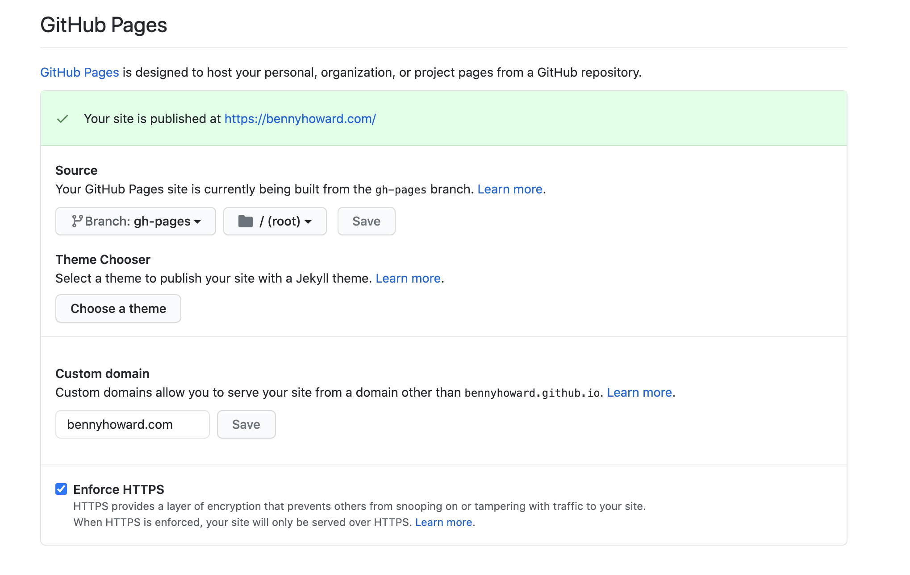

# Github Page for BennyHoward

Source code for Github Pages [bennyhoward.github.io](https://bennyhoward.github.io).  

## Author

- [Benny Howard](mailto:bennyhoward.opensource@gmail.com)

## Contributing

*No contributions will be accepted in this repository.*  

## License

  
This work is licensed under a <a rel="license" href="http://creativecommons.org/licenses/by-sa/4.0/">Creative Commons Attribution-ShareAlike 4.0 International License</a>.  

## Requirements

- A shell command interpreter such as  `sh`, `bash`, `zsh`, etc.
- [Homebrew](https://brew.sh/) package manager for Mac
- The command line JSON Querying Tool [`jq`](https://stedolan.github.io/jq/)
- The runtime agnostic version manager [ASDF VM](http://asdf-vm.com/)
- [ASDF VM plugin for Node.js](https://github.com/asdf-vm/asdf-nodejs)
- Command line JavaScript runtime [Node.js](https://nodejs.org/en/)

**TODO**: Add Windows and Linux requirements.

## Getting Started

The following are instructions for setting up your development environment to run this repository.  

### Install Homebrew

To install the Homebrew package manager for Mac, run the following command:  

```sh
/bin/bash -c "$(curl -fsSL https://raw.githubusercontent.com/Homebrew/install/HEAD/install.sh)"
```

### Install the Command Line JSON Querying Tool `jq`

[`jq`](https://stedolan.github.io/jq/) is a command line JSON Querying Tool that takes JSON as input and outputs a filtered JSON.  

Install it on a Mac using Homebrew with the following command:  

```sh
brew install jq
```

**TODO**: Add instructions for installing ASDF VM, ASDF VM Node.js plugin, and Node.js

## Usage

### Deploying

The contents of the dist folder is what gets deployed.  

The deployment script, [deploy.sh](./deploy.sh) will run the deployment.  
This deployment script will overwrite the [LICENSE](./LICENSE) file in the `dist` folder every time.  

**DO NOT** forget to also include to add the [LICENSE](./LICENSE) file in the `dist` folder for the deployment branch `gh-pages`.  

To deploy run the following command:  

```sh
sh ./deploy.sh
```

## How to Setup repo for Github Pages and Prepare it for a Custom Domain Name

Github Pages is a free service offered by Github to host static sites from a repository.  

When you create your static site, it's hosted as a subdomain on [github.io](https://github.io), where the subdomain is the username.  
For example, for the Github user [BennyHoward](https://github.com/BennyHoward) the corresponding Github page will be [bennyhoward.github.io](https://bennyhoward.github.io).  

**NOTE**: However, in this case, because we are also deploying a CNAME file to Github Pages, the domain [bennyhoward.github.io](https://bennyhoward.github.io) will resolve to [bennyhoward.com](https://bennyhoward.com/).  

In order to create Github Page, you must create a special reop called `<username>.github.io` after the reserved subdomained URL, where `<username>` is your Github username, but all lowercase.  

**NOTE**: Notice that the username as it appears in the subdomain is all lowercase as opposed to the user name.  This is important, if the subdomain is not all lowercase, your page will not work.  

To create a repo for your Github Page you must first create the repo in the interface in Github.  
The repository must be public in order for this to work.  

Run the following command for the initial commit:  

```sh
echo "# Github Page for $github_username" >> README.md
mkdir ./dist
echo "<h1>Github Page for $github_username</h1>" > ./dist/index.html
git init
git add -A
git commit -m "first commit"
git branch -M main
git remote add origin "https://github.com/$github_username/$github_username_lowercase.github.io.git"
git push -u origin main
```

**NOTE**: Replace `$github_username` with your Github username and replace `$github_username_lowercase` is your with your Github username, but all lowercase.  

Then create a subtree branch called `gh-pages`.  
This is a branch whose root is at the `./dist` folder.  That way you deploy only what you want and not unnecessary files like `README.md`, etc.  
To create that subtree branch run the following command:  

```sh
git subtree push --prefix dist origin gh-pages
```

In the repository settings, set Github Pages to point to the branch `gh-pages`.  
Also notice "Custom Domain" and "Enforce HTTPS".  
If you have a custom domain you'd like to point to you Github page, enter it into the "Custom Domain" field, in this case it's [bennyhoward.com](https://bennyhoward.com/).  
And don't forget to check "Enforce HTTPS".  While HTTPS isn't a big deal for an open source static website, it's good to get into the habit of securing you software as much as you can.  



## References

- [Getting started with GitHub Pages
](https://docs.github.com/en/github/working-with-github-pages/getting-started-with-github-pages)
